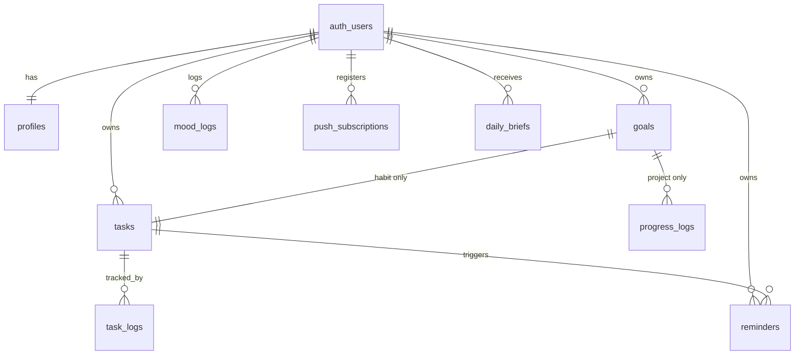

# Routine Tracker — Product Requirements Document

**Version:** v1.0 · **Date:** June 2026 · **Target build agent:** Claude Code

> This is the canonical product spec. The foundation-slice spec under
> `docs/superpowers/specs/` scopes what is built first. When they disagree,
> the slice spec wins for the current session; this PRD is the long-term target.

---

## 1. Overview

A personal routine and goal tracker built around **monthly goals that decompose
deterministically into a daily routine**. Adds a daily Stoic-tradition reminder,
an LLM-generated personal "proud line" pulled from the user's own recent
progress, and a lightweight mental-health check-in.

Single-user MVP, designed to scale to a small multi-user setup without rework.
Used primarily on Android as an installable PWA. All scheduling and delivery
happens server-side — the app does no background work on the device.

### In scope for v1
- Monthly goals (habit + project), full CRUD, edit anytime.
- Deterministic daily routine view that recomputes every render.
- Per-task and daily-brief push notifications.
- Curated Stoic daily quote (public domain).
- LLM-generated daily motivation, with templated fallback.
- Daily mood check-in.

### Out of scope for v1 (v2 / v3)
- iOS support.
- Wins log with auto/manual entries and proud-resurfacing UI.
- Health metrics (sleep, water, exercise) — v2.
- LLM goal suggestion from natural-language input — v2.
- Charts, streaks UI, monthly heatmaps — v3.
- Social / sharing.

---

## 2. Tech Stack (pinned)

| Layer | Choice | Notes |
|---|---|---|
| Frontend | Next.js (App Router, TypeScript) on Vercel | Deployed as a PWA |
| Mobile delivery | Installable PWA (manifest + service worker) | Chrome on Android |
| Backend DB | Supabase Postgres | All persistent state |
| Auth | Supabase Auth | Email + password or magic link |
| Server logic | Supabase Edge Functions (Deno + TS) | Notification processor, daily brief generator |
| Scheduling | Supabase Cron (pg_cron + pg_net) | Replaces Vercel cron and any external queue |
| Push delivery | Web Push with VAPID (`web-push` library) | Subscriptions stored in DB |
| Secrets | Supabase Vault + Vercel env vars | VAPID private key, LLM keys |
| LLM | Groq (primary) + Google AI Studio Gemini 2.5 Flash (fallback) | Both OpenAI-SDK compatible |
| Local dev | Claude Code on developer's computer | Supabase CLI optional; dashboard-only for v1 |

**Explicitly not used:** Vercel Cron, QStash, third-party push providers
(OneSignal etc.), separate FCM project, Supabase CLI (dashboard editor for Edge
Functions in v1).

---

## 3. Architecture

```
Browser (PWA, Android Chrome)
├── React UI (Next.js)
├── Service Worker (push receiver, offline shell)
└── Push Subscription (VAPID)
                ▲
                │ Web Push (over FCM, transparent to us)
                │
Supabase Edge Function: notification-processor
                ▲
                │ pg_net HTTP call
                │
Supabase Cron (pg_cron) — every minute, UTC
                │
                └── reads `reminders` where next_fire_at <= now()

User actions  ─► Vercel (Next.js routes) ─► Supabase Postgres
                                            (RLS: user_id = auth.uid())

LLM calls     ─► Supabase Edge Fn `daily-brief-generator`
                ─► Groq, fallback Gemini, fallback template
                ─► upsert into `daily_briefs`
```

**Two architectural rules:**
1. All user-data writes go through Supabase with RLS enforced.
2. All push deliveries are owned by the every-minute Edge Function — the client
   never schedules anything itself.

---

## 4. Environment & constraints

- **Primary device:** Vivo V60, Funtouch OS 15 (Android 15).
- **Default user timezone:** `Asia/Kolkata` (UTC+5:30).
- **Critical timing constraint:** pg_cron runs in UTC. All `next_fire_at`
  columns store UTC; display logic converts to user timezone.
- **Funtouch battery management:** can throttle/delay notifications. Show a
  one-time onboarding nudge: *"For reliable reminders, open Settings → Battery →
  App Battery Usage → Chrome (or this app) and set it to 'unrestricted'."*
  Optionally link to dontkillmyapp.com.
- **iOS:** out of scope for v1. Schema/architecture are iOS-compatible (PWA
  install + iOS 16.4+ Web Push); only install/permission UX changes.

---

## 5. Data Model

### 5.1 ERD



`stoic_quotes` is intentionally unlinked — a global, public-read table.

### 5.2 Tables

**profiles** — mirrors `auth.users`, created via signup trigger.
```sql
create table profiles (
  id uuid primary key references auth.users(id) on delete cascade,
  display_name text,
  timezone text not null default 'Asia/Kolkata',
  quiet_hours_start time,
  quiet_hours_end time,
  notif_prefs jsonb not null default '{}',
  created_at timestamptz not null default now(),
  updated_at timestamptz not null default now()
);
```

**goals** — habit or project, polymorphic via `goal_type`.
```sql
create type goal_type as enum ('habit', 'project');
create type goal_status as enum ('active', 'paused', 'completed', 'archived');
create type recurrence_type as enum ('daily', 'weekly_days', 'weekly_count');

create table goals (
  id uuid primary key default gen_random_uuid(),
  user_id uuid not null references auth.users(id) on delete cascade,
  title text not null,
  description text,
  category text,
  goal_type goal_type not null,
  period_month date not null,                -- first day of the month
  status goal_status not null default 'active',
  -- habit fields
  recurrence_type recurrence_type,
  weekdays int[],                            -- 0=Sun..6=Sat for weekly_days
  target_count int,                          -- for weekly_count
  scheduled_time time,
  -- project fields
  target_value numeric,
  current_value numeric default 0,
  unit text,                                 -- 'pages', 'km', 'sessions'
  due_date date,                             -- defaults to last day of period_month
  created_at timestamptz not null default now(),
  updated_at timestamptz not null default now()
);
create index on goals (user_id, status);
create index on goals (user_id, period_month);
```

**tasks** — habit task templates. Auto-created via trigger when a habit goal is inserted.
```sql
create table tasks (
  id uuid primary key default gen_random_uuid(),
  user_id uuid not null references auth.users(id) on delete cascade,
  goal_id uuid not null references goals(id) on delete cascade,
  title text not null,
  recurrence_type recurrence_type not null,
  weekdays int[],
  target_count int,
  scheduled_time time,
  target_value numeric,
  unit text,
  is_active boolean not null default true,
  created_at timestamptz not null default now(),
  updated_at timestamptz not null default now()
);
create index on tasks (user_id, is_active);
```

**task_logs** — habit task completion per day.
```sql
create type log_status as enum ('done', 'skipped', 'partial');

create table task_logs (
  id uuid primary key default gen_random_uuid(),
  user_id uuid not null references auth.users(id) on delete cascade,
  task_id uuid not null references tasks(id) on delete cascade,
  log_date date not null,
  status log_status not null,
  value numeric,
  note text,
  created_at timestamptz not null default now(),
  unique (task_id, log_date)
);
create index on task_logs (user_id, log_date);
```

**progress_logs** — project goal increments.
```sql
create table progress_logs (
  id uuid primary key default gen_random_uuid(),
  user_id uuid not null references auth.users(id) on delete cascade,
  goal_id uuid not null references goals(id) on delete cascade,
  log_date date not null,
  value_added numeric not null,
  note text,
  created_at timestamptz not null default now()
);
create index on progress_logs (user_id, log_date);
create index on progress_logs (goal_id);
```
Trigger: on insert, `update goals set current_value = current_value + new.value_added where id = new.goal_id`.

**reminders** — what pg_cron scans every minute.
```sql
create table reminders (
  id uuid primary key default gen_random_uuid(),
  user_id uuid not null references auth.users(id) on delete cascade,
  task_id uuid references tasks(id) on delete cascade,   -- nullable
  kind text not null,                                    -- 'task' | 'daily_brief' | 'mood_checkin'
  title_template text,
  scheduled_time time not null,                          -- in user's local timezone
  recurrence_type recurrence_type not null,
  weekdays int[],
  next_fire_at timestamptz not null,                     -- UTC, computed
  is_enabled boolean not null default true,
  last_sent_at timestamptz,
  created_at timestamptz not null default now(),
  updated_at timestamptz not null default now()
);
create index on reminders (next_fire_at) where is_enabled = true;
```

**push_subscriptions** — Web Push endpoints per device.
```sql
create table push_subscriptions (
  id uuid primary key default gen_random_uuid(),
  user_id uuid not null references auth.users(id) on delete cascade,
  endpoint text not null unique,
  p256dh text not null,
  auth_key text not null,
  user_agent text,
  created_at timestamptz not null default now(),
  last_seen_at timestamptz not null default now()
);
create index on push_subscriptions (user_id);
```

**mood_logs** — daily mental check-in.
```sql
create table mood_logs (
  id uuid primary key default gen_random_uuid(),
  user_id uuid not null references auth.users(id) on delete cascade,
  log_date date not null,
  mood int not null check (mood between 1 and 5),
  energy int check (energy between 1 and 5),
  gratitude text,
  note text,
  created_at timestamptz not null default now(),
  unique (user_id, log_date)
);
```

**stoic_quotes** — global, curated, public read.
```sql
create table stoic_quotes (
  id serial primary key,
  body text not null,
  author text not null check (author in ('Marcus Aurelius', 'Seneca', 'Epictetus')),
  source_work text,
  tags text[]
);
```
Seed with ~150 quotes from public-domain translations (Meditations, Letters from
a Stoic, Discourses, Enchiridion). Daily selection is deterministic (see §8.2).

**daily_briefs** — LLM-generated personal line, one row per user per day.
```sql
create table daily_briefs (
  id uuid primary key default gen_random_uuid(),
  user_id uuid not null references auth.users(id) on delete cascade,
  brief_date date not null,
  motivation_text text not null,
  stoic_quote_id int references stoic_quotes(id),
  generated_by text not null,                  -- 'groq' | 'gemini' | 'template'
  generated_at timestamptz not null default now(),
  unique (user_id, brief_date)
);
```

### 5.3 Row Level Security

**Mandatory** on every user-data table. Standard policy:
```sql
alter table <table> enable row level security;
create policy "own rows" on <table>
  for all using (user_id = auth.uid())
  with check (user_id = auth.uid());
```
Apply to: `profiles` (id = auth.uid()), `goals`, `tasks`, `task_logs`,
`progress_logs`, `reminders`, `push_subscriptions`, `mood_logs`, `daily_briefs`.

`stoic_quotes` is the exception — public read only:
```sql
alter table stoic_quotes enable row level security;
create policy "anyone can read" on stoic_quotes for select using (true);
```

### 5.4 Triggers
1. `handle_new_user` — on `auth.users` insert, create matching `profiles` row.
2. `handle_new_habit_goal` — on `goals` insert where `goal_type = 'habit'`,
   create matching `tasks` row mirroring the habit fields.
3. `bump_goal_progress` — on `progress_logs` insert, add `value_added` to
   `goals.current_value`.
4. `set_updated_at` — generic trigger on every table with `updated_at`.

---

## 6. Feature Phasing

### v1 (MVP)
1. Auth (email/password or magic link).
2. Onboarding: timezone confirm, push permission, battery-exclusion nudge.
3. Goals CRUD: habit or project, edit, archive.
4. Daily routine view (home): today's habit tasks (check-offs), today's project
   paces, mood check-in, Stoic quote, daily brief.
5. Habit completion (done / skipped / partial, optional value).
6. Project progress logging.
7. Reminders: from tasks or standalone (daily brief, mood check-in).
8. Web Push: VAPID, service worker, subscription on permission.
9. Edge Function `notification-processor`: per-minute cron, sends due pushes,
   advances `next_fire_at`.
10. Edge Function `daily-brief-generator`: per-user daily, calls LLM, writes
    `daily_briefs`.
11. Mood check-in.
12. Stoic quotes seed + deterministic daily pick.

### v2
- Wins log (manual + auto-detected) and "proud line" from real wins.
- `health_logs` flexible schema (`metric_type`, `value`, `unit`, `log_date`).
- Streaks UI and per-goal stats.
- LLM goal suggestion from free-text input.

### v3
- Charts (monthly heatmap, streak calendars, project burndown).
- "Lighten today" LLM-assisted soft-skip with reason.
- Multi-user polish.

---

## 7. v1 Feature Specs

### 7.1 Goals
**Create form:** title, description, category (free chip), goal type, period_month
(default current).
- Habit: `recurrence_type` (daily, weekly_days, weekly_count), optional
  `scheduled_time`, optional `target_value` + `unit`.
- Project: `target_value`, `unit`, `due_date` (default last day of period_month).

**Edit / archive / delete:** all available any time. Archiving keeps history;
deleting cascades.

**Period switching:** UI picks a month; active goals for that month feed the
routine. Default = current month.

### 7.2 Routine engine (deterministic)
Computed at render time. No stored daily plan.

```ts
async function todayRoutine(user, today: Date) {
  const tasks = await db.tasks
    .where({ user_id: user.id, is_active: true })
    .join(goals, on => goals.id === tasks.goal_id)
    .where(goals.status === 'active');

  const habitItems = await Promise.all(tasks.map(async t => {
    if (t.recurrence_type === 'daily') return shape(t, true);
    if (t.recurrence_type === 'weekly_days')
      return shape(t, t.weekdays.includes(weekdayOf(today, user.timezone)));
    if (t.recurrence_type === 'weekly_count') {
      const done = await countDoneThisWeek(t.id, today, user.timezone);
      return shape(t, done < t.target_count, { weekly_progress: `${done}/${t.target_count}` });
    }
  }));

  const projectGoals = await db.goals.where({
    user_id: user.id, goal_type: 'project', status: 'active',
  });
  const projectItems = projectGoals.map(g => paceItem(g, today));

  const mood = await db.mood_logs.findOne({ user_id: user.id, log_date: today });
  const stoic = pickStoicForDate(today, user.timezone);
  const brief = await db.daily_briefs.findOne({ user_id: user.id, brief_date: today });

  return { habit: habitItems.filter(i => i.due), project: projectItems, mood, stoic, brief };
}

function paceItem(goal, today) {
  const remaining = goal.target_value - goal.current_value;
  const daysLeft = Math.max(1, daysBetween(today, goal.due_date));
  const weeksLeft = Math.max(1, daysLeft / 7);
  return {
    goal_id: goal.id, title: goal.title,
    weekly_target: remaining / weeksLeft, unit: goal.unit,
    progress: `${goal.current_value} / ${goal.target_value} ${goal.unit}`,
    on_track: goal.current_value >= expectedSoFar(goal, today),
  };
}
```
**The point:** edit a goal and the next render reflects it — no regeneration step.

### 7.3 Task completion
Tap a habit task → `task_logs` row (status `done` by default, value optional).
Long-press → "skipped" or "partial." UI uses today's `task_logs` for checked state.

### 7.4 Project progress
Each project tile has `+ log progress`. Modal asks `value_added` + optional note
→ inserts `progress_logs` → trigger bumps `current_value` → pace recomputes.

### 7.5 Reminders + Web Push
**Setup (one-time):** generate VAPID keypair; store private key in Vault as
`vapid_private_key`; expose public key as `NEXT_PUBLIC_VAPID_PUBLIC_KEY`. On an
explicit user tap: `Notification.requestPermission()` →
`pushManager.subscribe({ userVisibleOnly: true, applicationServerKey })` → POST
to a Next.js API route → insert into `push_subscriptions`.

**Reminder rows** created when: a task with `scheduled_time` is created (task
reminder); a user enables daily-brief notifications (one `daily_brief` reminder);
a user enables mood-checkin. `next_fire_at` computed in UTC from `scheduled_time`
+ `timezone`; recomputed whenever the schedule changes.

**`notification-processor` (per-minute, pg_cron via pg_net):** select enabled
reminders with `next_fire_at <= now()`; build body per kind; send to all of the
user's `push_subscriptions` via `web-push`; update `last_sent_at` and
`next_fire_at` via `computeNextFireAt`.

`computeNextFireAt`: `daily` → next day at `scheduled_time` (user tz → UTC);
`weekly_days` → next matching weekday; `weekly_count` → no per-day push in v1.

**pg_cron job** (SQL Editor, after enabling `pg_cron` + `pg_net`):
```sql
select cron.schedule('process-reminders', '* * * * *',
  $$ select net.http_post(
       url:='https://<project>.supabase.co/functions/v1/notification-processor',
       headers:=jsonb_build_object('Authorization','Bearer '||
         (select decrypted_secret from vault.decrypted_secrets where name='cron_invoke_token'))
     ); $$);
```

### 7.6 Daily brief generation
Edge Function `daily-brief-generator`, per user per day ~30 min before their
morning (default 06:30 local → 01:00 UTC for IST). Gathers context
(yesterday_logs, streaks, today_tasks, mood_trend, goals_summary), builds prompt
(1–2 sentence motivation), calls LLM, picks Stoic quote, upserts `daily_briefs`.
The morning push reads `motivation_text` from this row.

### 7.7 LLM helper (`/lib/llm.ts`, server-side only)
```ts
type Provider = 'groq' | 'gemini' | 'template';
export async function complete(prompt: string): Promise<{ text: string; provider: Provider }> {
  for (const provider of ['groq', 'gemini'] as const) {
    try {
      const text = await callProvider(provider, prompt);
      if (!text || text.length < 5) throw new Error('empty');
      return { text, provider };
    } catch (e) { console.warn(`${provider} failed:`, e.message); }
  }
  return { text: templateFallback(prompt), provider: 'template' };
}
```
- **Groq:** `baseURL = https://api.groq.com/openai/v1`, model `llama-3.3-70b-versatile`.
- **Gemini:** `baseURL = https://generativelanguage.googleapis.com/v1beta/openai/`, model `gemini-2.5-flash`.
Never call from the client.

### 7.8 PWA shell
- `manifest.json` at `/manifest.json`: name, short_name, icons (192, 512),
  `start_url: '/'`, `display: 'standalone'`, theme/background color.
- `service-worker.js` at root: `push` → `showNotification`; `notificationclick`
  → `clients.openWindow(url)`.
- Offline shell: cache app shell + last `todayRoutine` payload.

### 7.9 Auth
- Supabase Auth. Magic link is the simpler v1 path.
- After signup: `handle_new_user` creates `profiles` with default
  `timezone = 'Asia/Kolkata'` and `display_name` from email.
- Onboarding: confirm timezone, "Enable reminders" button, Funtouch battery nudge.

---

## 8. Implementation Notes

### 8.1 Timezone handling
- User tz in `profiles.timezone` (IANA). UTC for all timestamptz. User-local DATE
  for `log_date`, `period_month`, `due_date`, `brief_date`. Convert local
  `scheduled_time` → UTC via `at time zone profiles.timezone` (SQL) or
  `date-fns-tz` (TS).

### 8.2 Stoic quote selection
```ts
function pickStoicForDate(date: Date, tz: string): Quote {
  const localDate = toZonedTime(date, tz);
  const dayOfYear = Math.floor(
    (localDate.getTime() - startOfYear(localDate).getTime()) / 86_400_000);
  return quotes[dayOfYear % quotes.length];
}
```
Same quote for all users on the same local calendar day. Zero per-user storage.

### 8.3 Recurrence semantics
- `daily` — every day, optionally at `scheduled_time`.
- `weekly_days` — only on weekdays in `weekdays[]` (0=Sun..6=Sat).
- `weekly_count` — flexible. No per-day reminder. Daily view shows it until the
  weekly quota is met, with `done/target` progress.

### 8.4 Pace math (project goals)
```ts
function expectedSoFar(goal, today: Date) {
  const total_days = daysBetween(goal.period_month, goal.due_date);
  const elapsed = daysBetween(goal.period_month, today);
  return goal.target_value * (elapsed / total_days);
}
```

### 8.5 Push permission gotcha
Android Chrome refuses the prompt if not triggered by a user gesture. Always wire
to an explicit button.

### 8.6 Edge Function deployment
v1: deploy via Supabase dashboard editor (no CLI). **Keep source in Git** (no
dashboard version history). Switch to CLI deploy later.

### 8.7 LLM fallback chain
Groq → (429/5xx/empty) → Gemini → (both fail) → template. Never crash the push
pipeline on LLM failure.

### 8.8 Idempotency
- `task_logs` unique `(task_id, log_date)`.
- `mood_logs` unique `(user_id, log_date)`.
- `daily_briefs` unique `(user_id, brief_date)` — upsert.
- reminder advancement: check `last_sent_at` to avoid double-push within a minute.

### 8.9 Keep-alive
Free-tier projects pause after 7 days idle. The per-minute cron prevents this —
do not disable without a replacement.

---

## 9. Environment Variables

### Vercel
```
NEXT_PUBLIC_SUPABASE_URL=
NEXT_PUBLIC_SUPABASE_ANON_KEY=
NEXT_PUBLIC_VAPID_PUBLIC_KEY=
SUPABASE_SERVICE_ROLE_KEY=         # server only
GROQ_API_KEY=                      # server only
GEMINI_API_KEY=                    # server only
```

### Supabase (Vault — for Edge Functions)
```
vapid_private_key
vapid_subject                      # e.g. mailto:you@example.com
groq_api_key
gemini_api_key
cron_invoke_token                  # random secret used by pg_cron
```

---

## 10. Build Sequence
1. **Schema.** All `create table`, enums, indexes, triggers, RLS. Seed
   `stoic_quotes` (~150).
2. **Auth + profiles.** Verify `handle_new_user`. Test with two accounts.
3. **Goals CRUD + routine view.** Deterministic engine. Verify pace + weekday filter.
4. **Habit check-offs.** done/skipped/partial → `task_logs`. Verify uniqueness.
5. **Project progress logging.** modal → `progress_logs` → trigger → pace recompute.
6. **Mood check-in.** One-tap UI.
7. **Stoic quote display.** Deterministic quote of the day.
8. **PWA shell.** manifest, service worker, install prompt.
9. **Web Push subscription.** Enable button → permission → subscribe → row.
10. **`notification-processor`.** Deploy; manual invoke with test reminder.
11. **pg_cron job.** Per-minute call; reminder 2 min out → delivery.
12. **LLM helper.** Groq → Gemini → template. Unit test mock 429.
13. **`daily-brief-generator`.** Manual invoke → `daily_briefs` row. Schedule.
14. **Onboarding flow.** Timezone, enable-reminders, Funtouch nudge.
15. **End-to-end smoke test on the V60.**

---

## 11. Critical Gotchas
1. **RLS or it's broken.** Enable on every user-data table; verify with two JWTs.
2. **pg_cron is UTC.** Store `next_fire_at` UTC; convert from user tz on write.
3. **Permission prompts need a tap.** Never `requestPermission()` on load.
4. **Funtouch battery saver.** Without the nudge, reminders arrive late/batched.
5. **LLM keys are server-only.** Vault in Edge Functions, Vercel server env for routes.
6. **Cache LLM output.** Read from `daily_briefs`; don't regenerate per render.
7. **Idempotency on logs and briefs.** Unique constraints prevent doubles.
8. **Free-tier pause.** Don't disable the per-minute cron — it doubles as keep-alive.
9. **Dashboard editor has no rollback.** Keep Edge Function source in Git.
10. **Stoic seed quality.** Clean public-domain translations only.

---

## 12. Definition of Done (v1)
- Two test accounts each create goals, see their own routine, log progress, and
  receive push on their own device — no data bleed (RLS verified).
- A morning push arrives carrying the day's motivation line (LLM or templated).
- Editing a goal mid-month reflects on the next render with no regeneration step.
- The Stoic quote is the same for all users on the same local-calendar day.
- Funtouch battery nudge appears in onboarding.
- Removing a goal/task cascades correctly; logs survive only as long as their
  parent (or are intentionally preserved — confirm choice).

---

## Appendix A — Suggested directory layout
```
/app                          Next.js App Router
  /(auth)/login/page.tsx
  /(app)/page.tsx             Home / routine view
  /(app)/goals/page.tsx
  /(app)/goals/[id]/page.tsx
  /(app)/mood/page.tsx
  /(app)/settings/page.tsx
  /api/push/subscribe/route.ts
/components
  RoutineView.tsx  GoalCard.tsx  HabitItem.tsx  ProjectItem.tsx
  MoodCheckIn.tsx  StoicQuote.tsx  DailyBrief.tsx
/lib
  supabase.ts   llm.ts   routine.ts   recurrence.ts   push.ts
/public
  manifest.json   service-worker.js   icon-192.png   icon-512.png
/supabase
  /functions/notification-processor   /functions/daily-brief-generator
  /migrations                         seed-stoic-quotes.sql
```

## Appendix B — Stoic seed
Public-domain translations (Long's Meditations, Stewart's Letters from a Stoic,
Higginson's Discourses, Carter's Enchiridion). Keep `body` under ~280 chars so it
fits a notification.
